# MedKnow项目经验

## 第一章 定义接口（Apifox为例）

接口分为接口名称、请求参数、返回响应四个基本部分。下面举例逐一讲解接口定义的主要步骤。

### 1.1 接口名称

接口名称在此处规定为名称、类型和路径的统称。

#### 1.1.1 准备工作

右键想要添加接口的目录，选择“添加HTTP接口”。

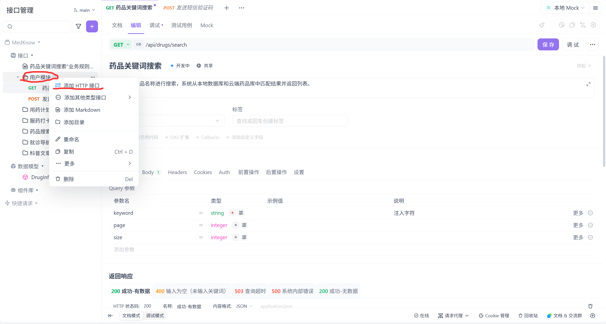

#### 1.1.2 接口类型

添加完接口后，选择接口类型，一般为`GET`、`PUT`、`POST`、`DELETE`四种类型。

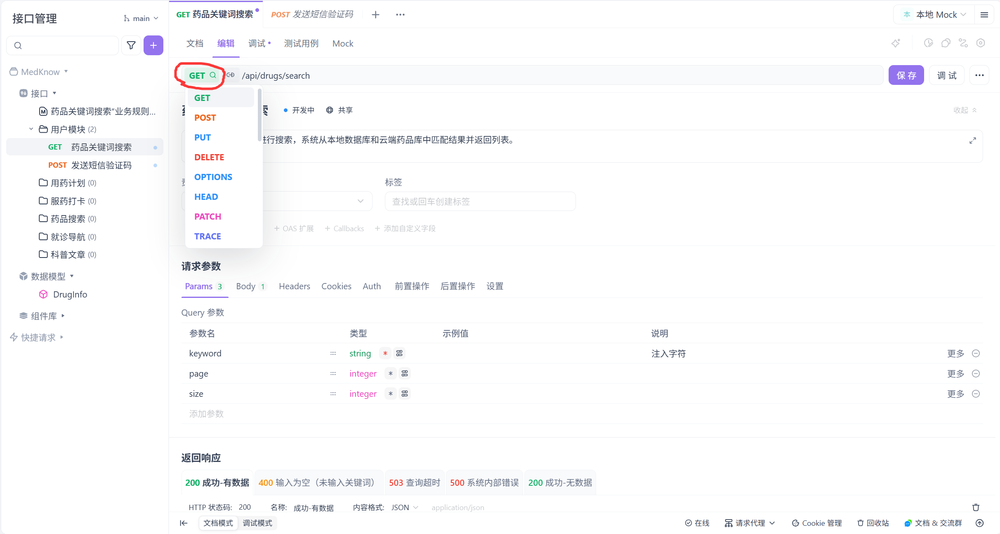

#### 1.1.3 接口路径

定义完接口类型后，接下来需要定义接口路径，接口路径命名需遵循一般命名公式：

`/api + /版本号 + 名词 + 动词`

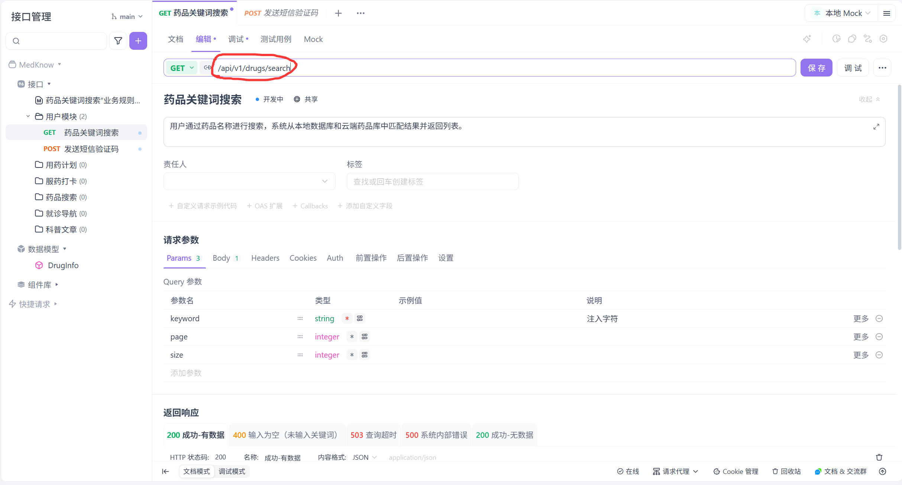

#### 1.1.4 名称

成功完成前三步之后，单击紫色按钮“保存”，在随后的弹窗中输入名称后保存，便可完成接口名称的设置工作。

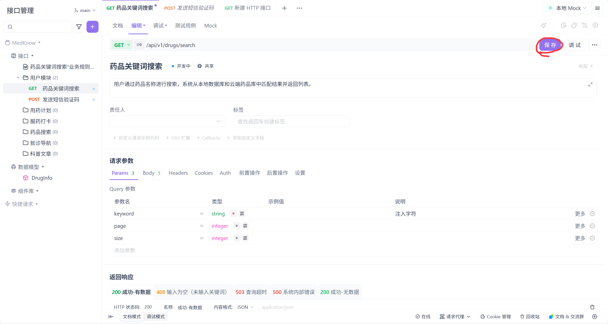

### 1.2 请求参数

在四种常用的接口中，`GET`接口得益于其平滑的请求参数特点，在该部分常常不需要定义`Body`。而`PUT`与`POST`接口则刚好需要定义`Body`来实现其复杂的结构，该部分的`Body`定义与随后即将讲到的“返回响应”中的`Body`定义如出一辙，甚至可以说是一模一样。这里以`GET`类型的接口为例。

1. 将视线转向左下角，将接口的编辑模式设置为“文档模式”。

2. 在“请求参数”栏目下，切换到“Params”目录，并根据需要添加Query参数。

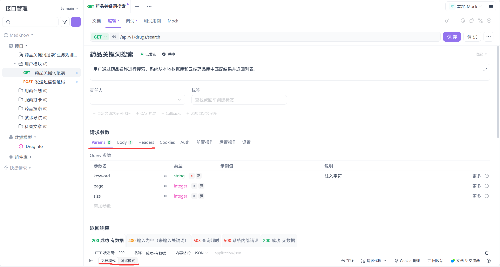

3. 根据页面，填全参数信息，主要包含：参数名、类型、是否必须、说明。

4. 若所添加的参数存在范围、默认值等限制，则需要转到高级设置。点击图标后，根据弹窗提示，便可完成相关设置。

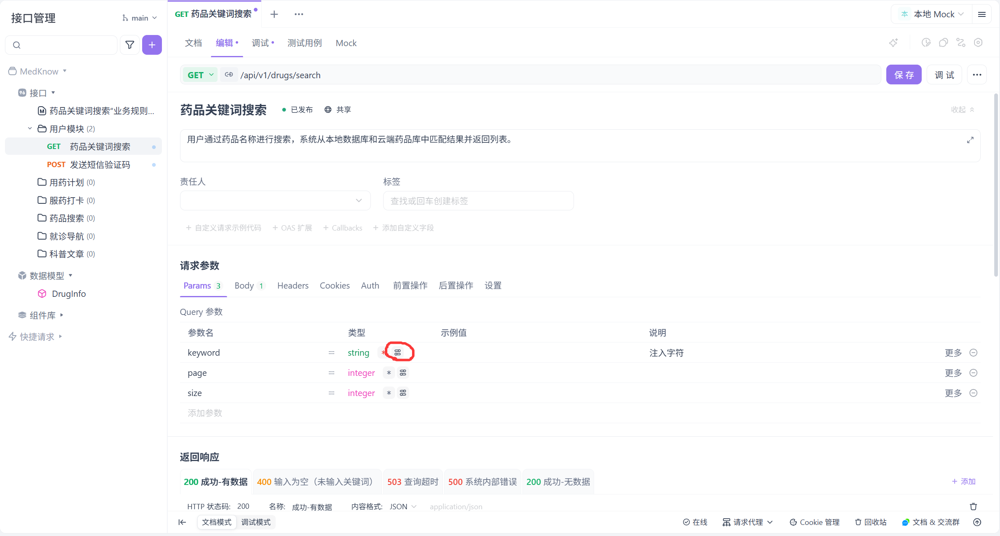

### 1.3 返回响应

该部分主要定义接口的不同返回状态，即成功、错误等等。按照先后顺序，该部分可再划分为定义状态、定义`Body`、添加示例。

#### 1.3.1 定义状态

将光标移至“返回响应”附近，会在最右边看见“+添加”入口，点击后再选择“添加空白响应”。在随后的弹窗中，根据需要自行选择状态码与名称，但格式要求为`JSON`。单击确定后，便成功定义了一种空白的返回状态。

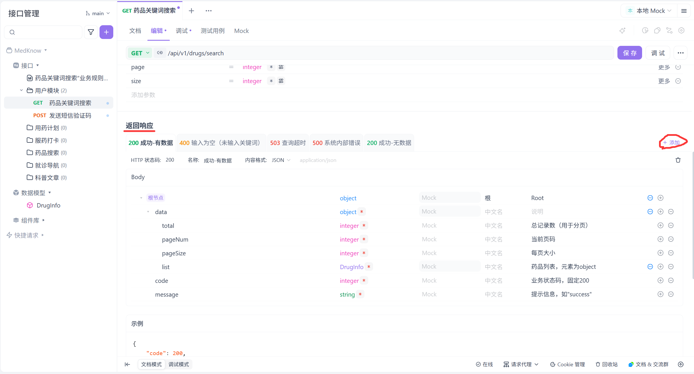

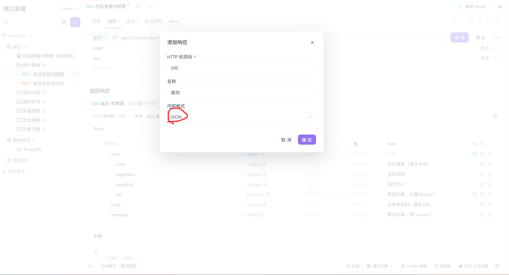

#### 1.3.2 定义`Body`

在`Body`定义列表中，同样是添加参数，与前面所述的添加Query参数大体相同。因此，此处仅说明与前文的不同之处。

`Body`实际上是一种树状结构，父节点类型必须为`Object`。`Body`仅有一个根节点，在Apifox中通常已经添加完成，仅需补充根节点名称即可。如需添加新参数，仅需在已添加参数的右侧单击增加选择即可。

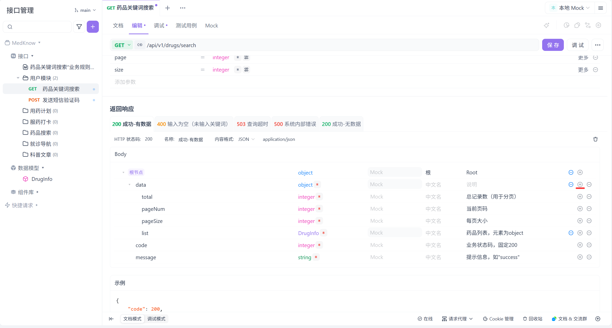

如果有要求需要选用`array`类型参数，其`ITEMS`为设置该数组的元素类型，如果选用`Object`类型，则意义为该数组为对象数组。在其下可再根据需要新增若干参数，意义为对象的属性。

在多个接口之间，往往存在一定的关系。这就意味着，接口之间可能存在能够复用的结构。因此，在设计接口时我们有必要提炼出重复多次使用的结构，将该结构单独设置一种自定义的数据类型，能够让我们不再重复多次定义相同的结构。接下来便说明自定义数据类型的方法。

1. 将光标移至左侧“数据模型”栏目处，随后在右侧单击“···”。在弹窗中单击“新建数据模型”。

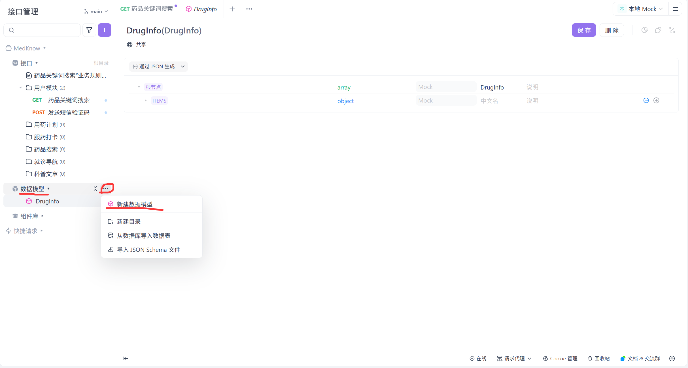

2. 在最上方输入自定义的数据类型的名称，随后单击“保存”。

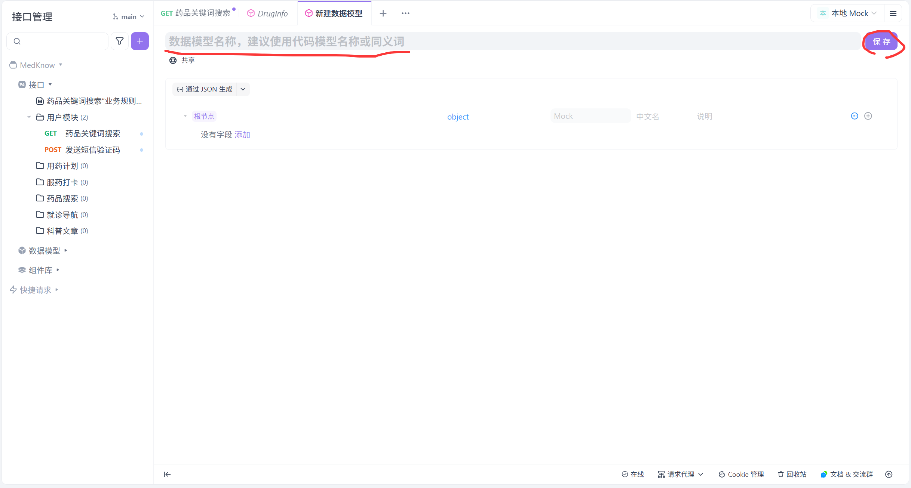

3. 按照定义`Body`的方法，为该数据类型定义参数。

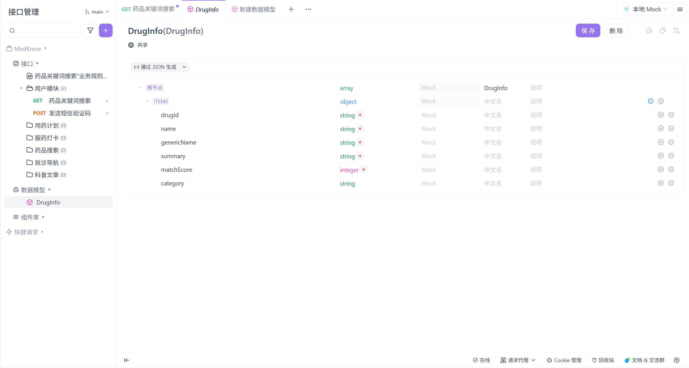

4. 在需要调用该数据类型的地方，首先新建一个参数，将该参数的类型设置为“引用类型”。

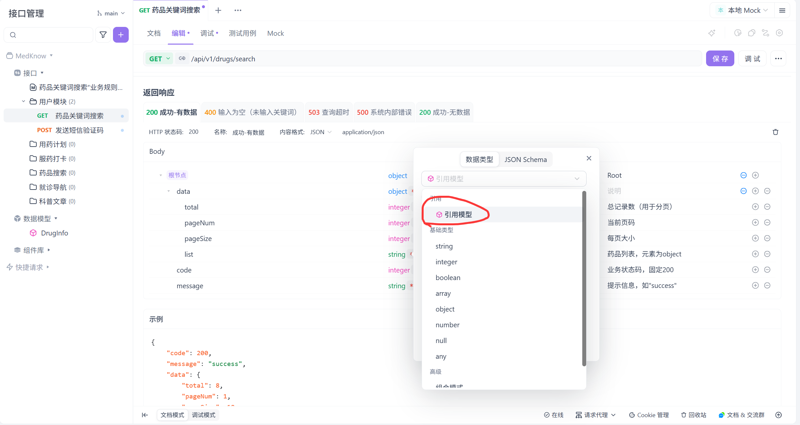

5. 在其后的弹窗中，选择我们定义好的数据类型。便可完成自定义的数据类型的调用。

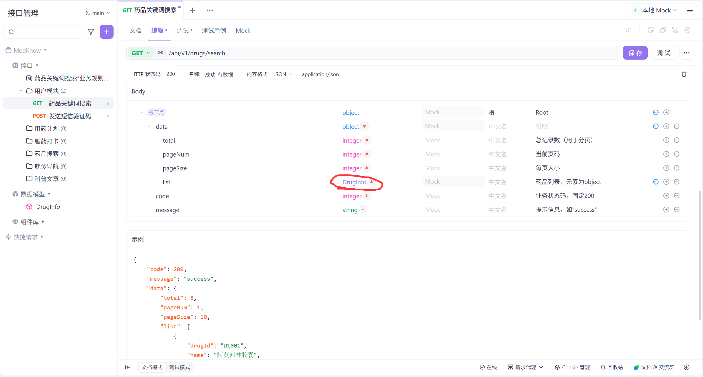

#### 1.3.3 添加示例（可选）

该部分提供接口的具体实现例子，主要用于具象化该接口的内容与功能，为可选项。

首先